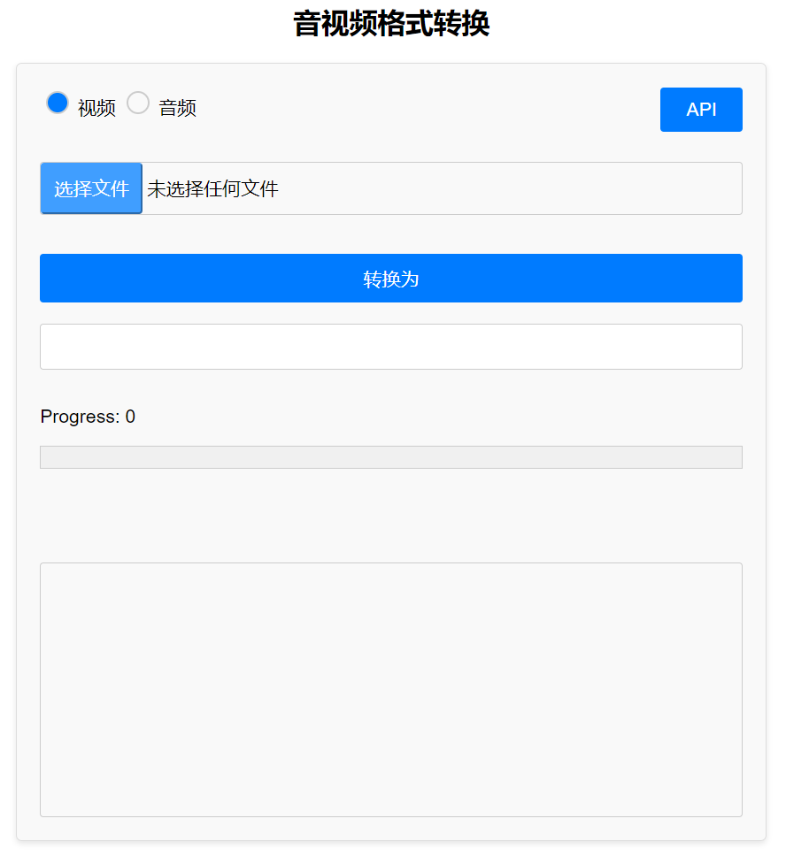
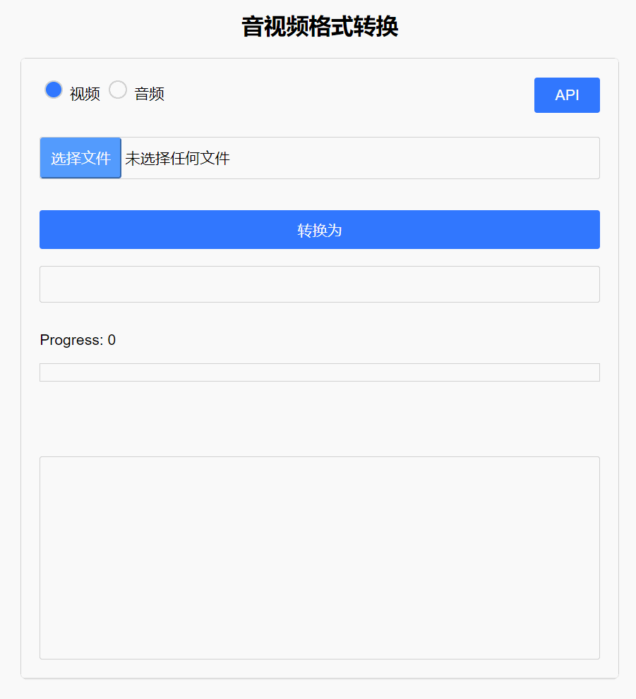

<h1 align="center">Easy Format Converter</h1>

### Overview
一个简洁的音频/视频格式转换工具，支持同时处理多种不同的音视频格式，并提供简单易用的界面和可调用的API。

### Features

- **批量文件格式转换：** 可以一次性转换多个音频或视频文件。
- **多格式支持：** 能够处理多种不同的音视频格式，无需担心输入文件的种类。
- **API支持：** 提供API接口，使其可以被外部应用程序调用。

### How to use

1. **安装Java 17或更高版本**
   - 在开始使用之前，请确保已安装Java 17或更新的版本。

2. **下载最新版本**
   - 前往 [releases](https://github.com/FangDaniu666/easy-format-converter/releases) 页面下载最新的发布版本。

3. **启动应用**
   - 运行下载的可执行文件（exe文件），启动 Easy Format Converter。

4. **选择文件类型和添加文件**
   - 根据需求选择要转换的文件类型（视频或音频）。
   - 添加一个或多个需要转换的文件。这些文件可以是不同的格式。

5. **设置转换格式并转换**
   - 输入希望转换成的目标格式。
   - 点击“转换为”按钮，开始转换过程。

6. **等待转换完成**
   - 程序会自动处理文件转换，您只需等待转换完成即可。

  

